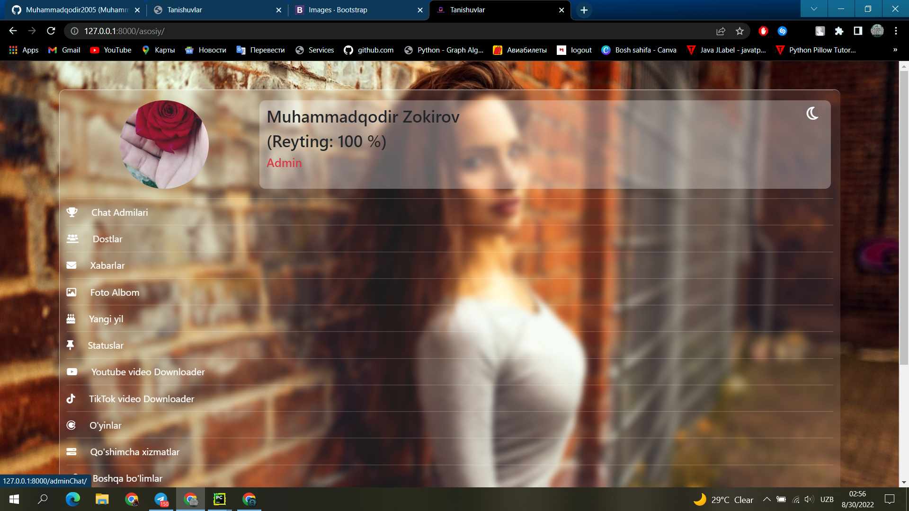
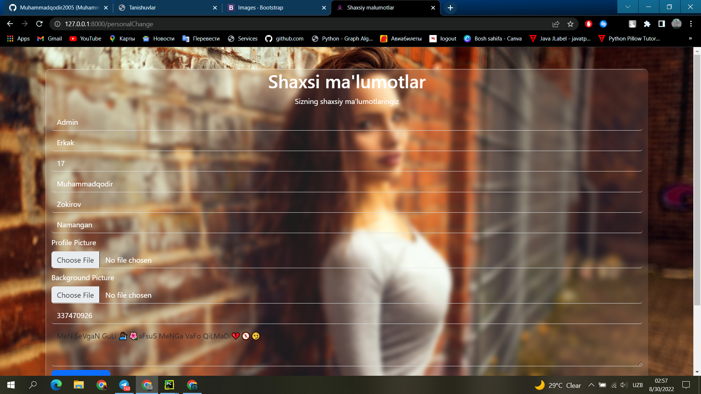
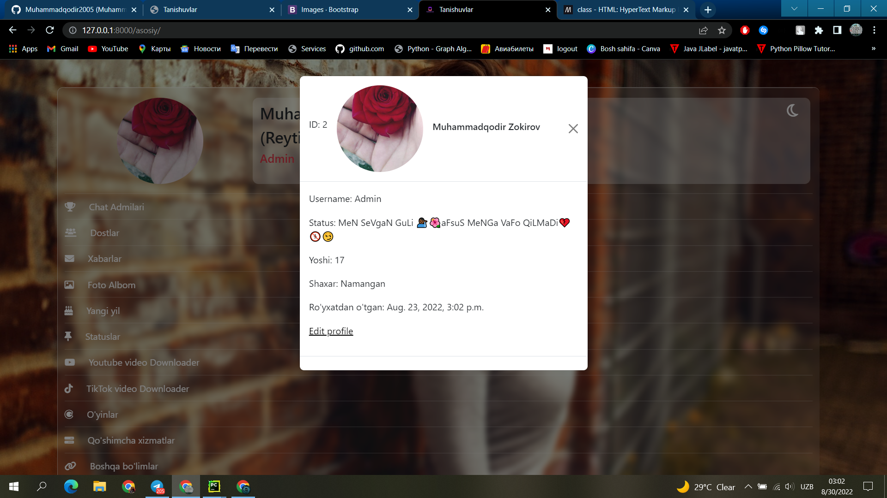
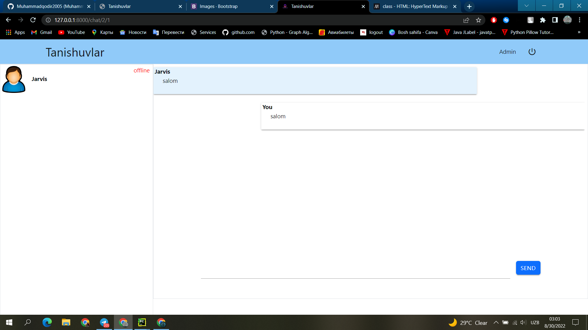

# Tanishuvlar chat

(_Mening qiziqarli loyihalarimdan biri_)

## O'rnatish

Ushbu ilova foydalanuvchilarning onlayn holatini saqlash uchun memcached-dan foydalanadi, shuning uchun uni
o'rnatishingiz kerak bo'ladi.

On Ubuntu:

```
sudo apt install memcached
```

Install virtualenv

```
pip install virtualenv
```

Loyiha katalogida,

Virtual environment yaratish

```
virtualenv venv
```

Activate

```
source venv/bin/activate
```

Install requirements

```
pip install -r requirements.txt
```

Ma'lumotlar bazasini ko'chirishni amalga oshiring

```
python manage.py makemigrations
python manage.py makemigrations chat
python manage.py migrate
```

Foydalanuvchilarni boshqarish uchun superuser yaratishga harakat qiling

```
python manage.py createsuperuser
```

Kerakli ma'lumotlarni bering

Rivojlanish serverini ishga tushiring

```
python manage.py runserver
```

## SAYTDAN LAVHALAR



